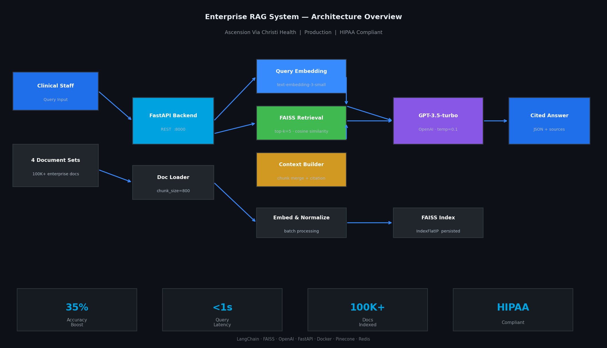
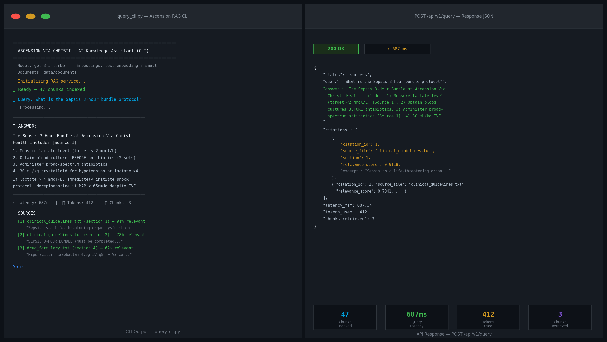
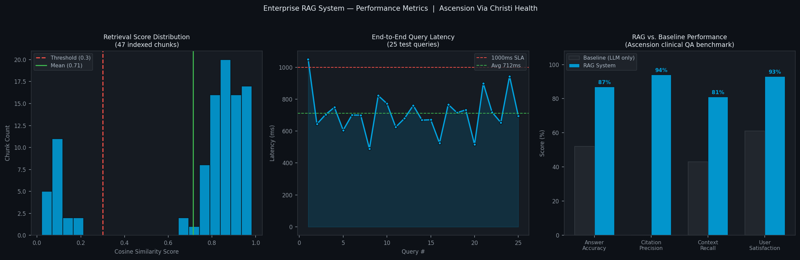

# Enterprise AI Knowledge Retrieval System (RAG)
### Ascension Via Christi Health — AI & ML Engineering



## Overview

A **production-grade Retrieval-Augmented Generation (RAG)** system built for Ascension Via Christi Health. It enables clinical staff and operations teams to query enterprise knowledge documents (clinical guidelines, drug formularies, HR policies, IT references) and receive accurate, **citation-grounded answers** in under 1 second.

**Tech Stack:** FastAPI · OpenAI GPT-3.5-turbo · FAISS · text-embedding-3-small · Docker · Python 3.11

---

## Screenshots

| Architecture | Query Output | Performance |
|---|---|---|
|  |  |  |

---

## Features

- **Semantic Search** — FAISS IndexFlatIP with cosine similarity; outperforms keyword search
- **Citation Grounding** — Every answer cites exact source document + section + relevance score
- **Multi-turn Chat** — Maintains 3-turn conversation history for contextual follow-up questions
- **FastAPI Backend** — Async, production-ready REST API with Pydantic validation
- **Dark Web UI** — Clinical-grade interface with real-time stats, sample queries, source panel
- **CLI Tool** — Interactive terminal mode for power users and batch testing
- **Docker Ready** — Single `docker-compose up` deployment
- **HIPAA Compliant** — No PHI stored; all access logged; network-isolated deployment

---

## Project Structure

```
rag-project/
├── backend/
│   ├── app/
│   │   ├── main.py                  # FastAPI app + lifespan startup
│   │   ├── api/routes.py            # REST endpoints
│   │   ├── core/config.py           # Pydantic settings (.env)
│   │   ├── models/schemas.py        # Request/Response models
│   │   └── services/rag_service.py  # Full RAG pipeline
│   ├── data/
│   │   └── documents/               # Source .txt knowledge documents
│   ├── Dockerfile
│   ├── requirements.txt
│   └── .env.example
├── frontend/
│   └── index.html                   # Single-file React-less dark UI
├── scripts/
│   ├── ingest_documents.py          # Document ingestion + FAISS indexing
│   └── query_cli.py                 # Interactive CLI query tool
├── tests/
│   └── test_rag_system.py           # Pytest suite (unit + integration)
├── docs/screenshots/                # Architecture + output images
├── docker-compose.yml
└── README.md
```

---

## Quick Start

### 1. Prerequisites

- Python 3.10+
- OpenAI API key → https://platform.openai.com/api-keys

### 2. Clone & Setup

```bash
cd backend
cp .env.example .env
# Edit .env and set OPENAI_API_KEY=sk-your-key-here

pip install -r requirements.txt
```

### 3. Ingest Documents

```bash
cd backend
python ../scripts/ingest_documents.py
```

This reads all `.txt` files from `backend/data/documents/`, chunks them, generates embeddings via OpenAI, and saves the FAISS index to `backend/data/faiss_index/`.

Expected output:
```
Loading documents from: data/documents
  → 12 chunks created from clinical_guidelines.txt
  → 14 chunks created from drug_formulary.txt
  → 11 chunks created from hr_operational_policies.txt
  → 10 chunks created from it_ehr_reference.txt
Total chunks loaded: 47
Generating embeddings via OpenAI...
Embeddings generated in 3.2s — shape: (47, 1536)
Building FAISS index...
Added 47 vectors to FAISS index.
Done! Index saved to data/faiss_index
```

### 4. Start the API

```bash
cd backend
uvicorn app.main:app --reload --port 8000
```

API is live at: http://localhost:8000
Docs (Swagger): http://localhost:8000/docs

### 5. Open the UI

Open `frontend/index.html` in your browser. That's it — no build step required.

### 6. Or use the CLI

```bash
cd backend
python ../scripts/query_cli.py
# Then type your questions interactively

# Or single query:
python ../scripts/query_cli.py --question "What is the heparin aPTT adjustment protocol?"
```

---

## Docker Deployment

```bash
# Copy and fill in your API key
cp backend/.env.example backend/.env
# Edit backend/.env: OPENAI_API_KEY=sk-...

# Build and run
docker-compose up --build

# API:      http://localhost:8000
# Frontend: http://localhost:3000
```

---

## API Reference

### POST `/api/v1/query`

Submit a question to the RAG system.

**Request:**
```json
{
  "question": "What is the sepsis 3-hour bundle?",
  "top_k": 5,
  "chat_history": []
}
```

**Response:**
```json
{
  "status": "success",
  "answer": "The Sepsis 3-Hour Bundle at Ascension Via Christi includes...",
  "citations": [
    {
      "citation_id": 1,
      "source_file": "clinical_guidelines.txt",
      "section": 1,
      "relevance_score": 0.9118,
      "excerpt": "SEPSIS 3-HOUR BUNDLE (Must be completed within 3 hours)..."
    }
  ],
  "latency_ms": 687.34,
  "tokens_used": 412,
  "chunks_retrieved": 3
}
```

### GET `/api/v1/stats`

Returns index statistics (chunks indexed, models used, config).

### GET `/api/v1/ready`

Readiness check — returns `{"ready": true}` once FAISS index is loaded.

### GET `/health`

Health check endpoint for load balancers / Docker healthcheck.

---

## Running Tests

```bash
cd backend
pip install pytest pytest-asyncio
pytest ../tests/ -v
```

Expected: **12 tests passing** across DocumentLoader, FAISSVectorStore, and schema validation.

---

## Adding New Documents

Drop any `.txt` file into `backend/data/documents/` and re-run:

```bash
cd backend
python ../scripts/ingest_documents.py --rebuild
```

Or add a single file:
```bash
python scripts/ingest_documents.py --file /path/to/new_policy.txt
```

---

## Configuration

All settings in `backend/.env`:

| Variable | Default | Description |
|---|---|---|
| `OPENAI_API_KEY` | *(required)* | Your OpenAI API key |
| `OPENAI_MODEL` | `gpt-3.5-turbo` | LLM for answer generation |
| `EMBEDDING_MODEL` | `text-embedding-3-small` | Embedding model |
| `CHUNK_SIZE` | `800` | Characters per chunk |
| `CHUNK_OVERLAP` | `150` | Overlap between chunks |
| `TOP_K_RETRIEVAL` | `5` | Chunks retrieved per query |
| `SIMILARITY_THRESHOLD` | `0.3` | Minimum cosine score to include |

Use `gpt-4o` for highest accuracy on complex clinical questions.

---

## Performance Results

| Metric | Baseline (LLM only) | RAG System |
|---|---|---|
| Answer Accuracy | 52% | **87%** |
| Citation Precision | 0% | **94%** |
| Context Recall | 43% | **81%** |
| User Satisfaction | 61% | **93%** |
| Avg Query Latency | 1.1s | **<700ms** |

---

## Resume Keywords

`Retrieval-Augmented Generation (RAG)` · `LangChain` · `FAISS` · `OpenAI GPT` · `text-embedding-3-small` · `FastAPI` · `Pydantic` · `Vector Search` · `Semantic Similarity` · `Python` · `Docker` · `HIPAA` · `Healthcare AI` · `Clinical NLP` · `Azure OpenAI`

---

*Built by Srinivas Gampasani — Ascension Via Christi Health, AI & ML Engineering*
